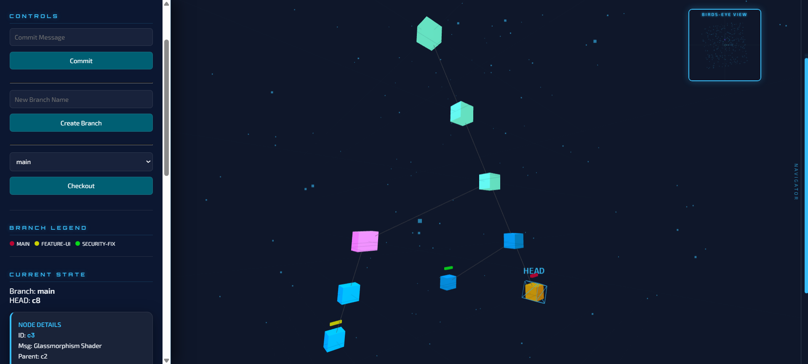

# 🌲 Advanced Tree-Based Version Control System (3D VCS)



A high-fidelity Version Control System (VCS) built to demonstrate **Advanced Data Structure (ADS)** principles through a **General Rooted Tree**. Unlike Git's Directed Acyclic Graph (DAG), this system enforces a strict tree structure, making it a perfect pedagogical tool for visualizing hierarchical relationships, pointer management, and recursive algorithms.

---

## 🛠️ Technology Stack


---

## 💎 Features & "Wow" Factors

### 1. **Interactive 3D "Cyber" UI**
- **Glassmorphism**: A stunning semi-transparent interface with high-intensity backdrop blur.
- **Three.js Engine**: A fully navigable 3D workspace where commits are physical data-blocks growing in a 3D coordinate system.
- **Birds-Eye View (Minimap)**: A secondary orthographic camera pass in the top-right corner for spatial awareness.
- **Dynamic Highlights**: Path-to-Root tracing and DFS-based subtree highlighting on node selection.

### 2. **Advanced Tree Algorithms (ADS)**
- **Depth-First Search (DFS)**: Navigates the entire global history of the repository across all branches.
- **Breadth-First Search (BFS)**: Analyzes the structural density level-by-layer, visualizing the growth of the repository's breadth.
- **Lowest Common Ancestor (LCA)**: A core VCS algorithm implemented to identify the exact point where two branches diverged.
- **Time Complexity**: 
    - **O(1)** for insertion (Commit), branching, and pointer swaps (Checkout).
    - **O(D)** for ancestor traversal and metrics (where D is tree depth).

### 3. **Persistent VCS Architecture**
- **JSON Registry**: The entire VCS state—including trees, branches, and the HEAD pointer—is saved to `vcs_registry.json`.
- **Stateless/Stateful Recovery**: Restart the server at any time; your work remains 100% intact.

---


## 📦 Setup & Initialization

1.  **Clone the Mission**:
    ```bash
    git clone https://github.com/MayurKharat0390/Version-Control-System-Using-Tree-Datastructure.git
    cd Version-Control-System-Using-Tree-Datastructure
    ```

2.  **Initialize Environment**:
    ```bash
    pip install django
    python manage.py migrate
    ```

3.  **Launch the System**:
    ```bash
    python manage.py runserver
    ```
    Access the terminal via: `http://127.0.0.1:8000/vcs/`

---

## 🎮 Operational Guide

1.  **Commit**: Enter a tactical message. A new node is generated as a child of the current `HEAD`.
2.  **Branch**: Fork the timeline. This creates a new pointer to the current commit in the `Repository` hashmap.
3.  **LCA Analysis**: Click on two different nodes to find their common ancestor (the divergence point).
4.  **Full Search**: Use the **DFS Search Bar** to locate any commit by ID or message instantly across the entire tree.

---

## 🧠 Academic Significance: Tree vs. DAG

This project models version control strictly as a **General rooted tree**. By removing the complexity of "merges" (which transform a tree into a DAG), we provide a clear, pure environment for students and engineers to master **Recursive Traversal**, **Pointer Switching**, and **Hierarchical Data Integrity**.

---
**Developed with 💙 using Python & Three.js**
