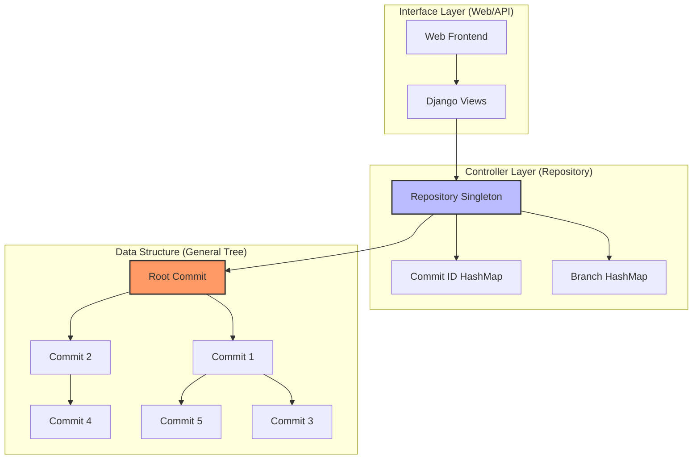
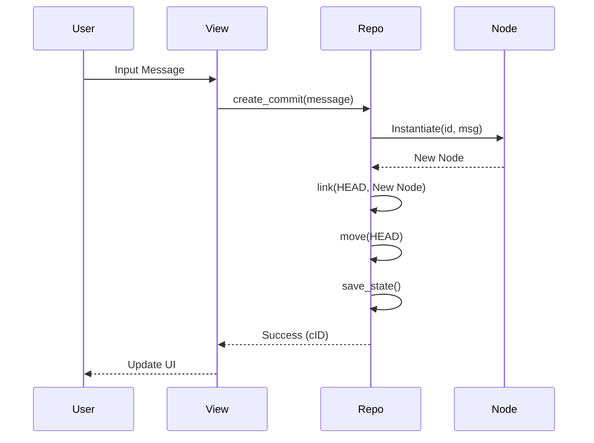
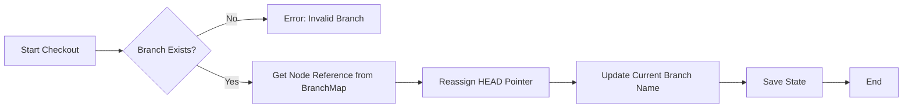

# Phase 2: Design & Algorithm Development - Tree-Based VCS

This document details the architectural design and algorithmic foundations of the **Tree-Based Version Control System (VCS)**. The system is built using academic "Advanced Data Structures" (ADS) principles, treating a version history as a **General Rooted Tree**.

---

## 1. System Architecture (Modular Design)

The system follows a modular architecture that separates data representation, structural control, and the interface layer.

### A. Data Layer ([Commit](file:///d:/PROJECTS/ADS%20Project/vcs_app/vcs_core.py#13-51) Node)
Represents a single state in the system.
- **Properties**: [id](file:///d:/PROJECTS/ADS%20Project/vcs_app/vcs_core.py#154-158), `message`, `timestamp`, `parent_pointer`, `children_list`.
- **Design Pattern**: Classical Tree Node.

### B. Controller Layer ([Repository](file:///d:/PROJECTS/ADS%20Project/vcs_app/vcs_core.py#56-459) Class)
Manages the tree structure and pointer manipulation.
- **Singleton Pattern**: Ensures only one repository instance exists in memory.
- **Pointer Management**: Maintains `HEAD` (active node) and `Branch Map` (hash map of branch names to node references).

### C. API Layer ([views.py](file:///d:/PROJECTS/ADS%20Project/vcs_app/views.py))
Exposes the repository logic as RESTful endpoints for the frontend.



---

## 2. Core Algorithms & Pseudocode

### A. Commit Creation (Leaf Insertion)
**Goal**: Add a new node as a child of the current `HEAD`.

```python
ALGORITHM CreateCommit(message):
    1. Create new_node with ID and message
    2. Set new_node.parent = HEAD
    3. Append new_node to HEAD.children
    4. Move HEAD pointer to new_node
    5. Update active branch pointer in BranchMap to new_node
    6. Return success
```
**Complexity**: $O(1)$ Time, $O(1)$ Space.

### B. Branching (Pointer Mapping)
**Goal**: Create a named reference to the current `HEAD`.

```python
ALGORITHM CreateBranch(branch_name):
    1. IF branch_name exists in BranchMap: RETURN ERROR
    2. BranchMap[branch_name] = HEAD (Reference pointer)
    3. Return success
```
**Complexity**: $O(1)$ Time (HashMap insertion).

### C. Depth-First Search (DFS) - Full History
**Goal**: Traverse the entire tree to provide a global view of all commits.

```python
ALGORITHM FullHistoryDFS(node):
    1. Add node.details to ResultList
    2. FOR EACH child IN node.children:
        FullHistoryDFS(child)
    3. RETURN ResultList
```
**Complexity**: $O(N)$ Time, $O(H)$ Space (recursion stack height).

### D. Breadth-First Search (BFS) - Level View
**Goal**: View chronological layers of the tree.

```python
ALGORITHM LevelViewBFS(root):
    1. Create Queue Q
    2. Q.enqueue((root, level=0))
    3. WHILE Q is not empty:
        A. (current, level) = Q.dequeue()
        B. Add current to LevelMap[level]
        C. FOR EACH child IN current.children:
            Q.enqueue((child, level + 1))
    4. RETURN LevelMap
```
**Complexity**: $O(N)$ Time, $O(W)$ Space (maximum tree width).

### E. Lowest Common Ancestor (LCA)
**Goal**: Find the closest shared history between two branches/commits.

```python
ALGORITHM FindLCA(nodeA, nodeB):
    1. PathA = Set of all ancestors of nodeA (by hopping parent pointers to Root)
    2. Current = nodeB
    3. WHILE Current is not NULL:
        A. IF Current in PathA: RETURN Current (Common Ancestor found)
        B. Current = Current.parent
    4. RETURN NULL (Should not happen in a single rooted tree)
```
**Complexity**: $O(Depth)$ Time, $O(Depth)$ Space.

---

## 3. Algorithmic Thinking & Edge Case Handling

### Edge Cases
1.  **Empty Tree**: Handled by initializing with an "Initial Commit" (Root).
2.  **Duplicate Branch Names**: Prevented via HashMap key validation.
3.  **Cyclic Commits**: Impossible by design as every node has exactly one parent (Tree property).
4.  **Checkout to Non-existent Branch**: Validated against the `Branch Map` before pointer reassignment.

### Optimization Strategy
- **Commits Map**: A dictionary/hashmap stores node references by ID, allowing $O(1)$ direct access to any commit without traversal.
- **Persistence**: Tree state is serialized to JSON after every mutation to ensure durability.

### Comparison of Traversals
| Algorithm | Use Case | Time Complexity | Space Complexity |
| :--- | :--- | :--- | :--- |
| **DFS** | Search, Subtree Extraction, Log | $O(N)$ | $O(H)$ |
| **BFS** | Visualizing levels, Layer analysis | $O(N)$ | $O(W)$ |
| **Backtracking** | Path to Root, checkout history | $O(Depth)$ | $O(Depth)$ |

---

## 4. Design Flowcharts

### Workflow: Create Commit


### Workflow: Checkout Branch


---

> [!TIP]
> **Performance Note**: For large trees (10,000+ nodes), DFS recursion may hit stack limits in Python. The implementation uses iterative backtracking for [get_log](file:///d:/PROJECTS/ADS%20Project/vcs_app/vcs_core.py#232-252) to avoid this, while using recursion for [get_tree_data](file:///d:/PROJECTS/ADS%20Project/vcs_app/views.py#124-135) where the depth is typically manageable in VCS structures.
