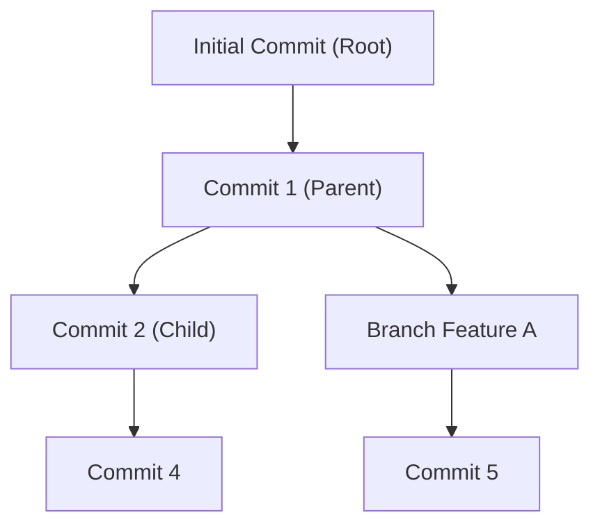

# 🌲 Project Presentation Guide: Tree-Based Version Control System (VCS)

This document is designed to help you explain the **Tree Data Structure (ADS)** concepts implemented in this project during your viva or presentation.

---

## 1. Core Data Structure: The General Rooted Tree
While real-world Git uses a **Directed Acyclic Graph (DAG)** to allow merging, this project strictly uses a **General Rooted Tree**.

### Characteristics:
- **Root Node**: The "Initial Commit" (The origin of all history).
- **Nodes**: Each commit is a [Node](file:///d:/PROJECTS/ADS%20Project/vcs_app/templates/vcs_app/index.html#708-729) containing metadata (ID, Message, Timestamp).
- **Strict Single-Parent Rule**: Unlike Git, a node here has **exactly one parent**. This simplifies the structure into a pure Tree.
- **Dynamic Branching**: Every node can have any number of children (Branches).

---

## 2. Advanced Algorithms (ADS Concepts)

### A. Depth-First Search (DFS)
**Used for**: `Global History Exploration`
- **Logic**: We start at the Root and recursively visit the deepest nodes of a branch before moving to siblings.
- **Pre-Order Traversal**: Visit(Node) -> Visit(Child 1) -> Visit(Child 2)...

### B. Breadth-First Search (BFS)
**Used for**: `Level-wise Structural Growth Analysis`
- **Logic**: Uses a **Queue** (`deque`) to visit all nodes at Depth 1, then all nodes at Depth 2.
- **Purpose**: This calculates the **Tree Width** at each depth level, helping visualize the branching density.

### C. Lowest Common Ancestor (LCA)
**Used for**: `Branch Divergence Point Detection`
- **Logic**: Given two commits (e.g., from two different branches), we trace their lineages back to the root. The **first intersection point** in their parent pointers is the LCA.
- **VCS Context**: This is the "Divergence Point" where the two branches originally split.

---

## 3. Minute Technical Differences: C++ vs. Python

When explaining this to your Mam, emphasize these implementation differences:

| Feature | C++ Implementation (Standard) | Python Implementation (This Project) |
| :--- | :--- | :--- |
| **Pointers** | Uses raw pointers (`Node*`) or smart pointers (`shared_ptr`). | Uses **Object References**. Variables point to objects in memory automatically. |
| **Memory** | Manual management ([new](file:///d:/PROJECTS/ADS%20Project/vcs_app/vcs_core.py#73-79)/`delete`). Risk of memory leaks. | **Automatic Garbage Collection**. Python cleans up unused nodes. |
| **Data Types** | Static Typing (`int`, `char*`). | Dynamic Typing. |
| **STL vs. Collections** | `std::vector<Node*>` for children; `std::queue` for BFS. | `list` for children; `collections.deque` for BFS Queue. |
| **Recursion** | Stack depth limited by physical memory. | Stack depth limited by Python's `sys.setrecursionlimit`. |

---

## 4. 3D Visualization: Three.js & Geometry
This is the "Wow Factor" of your project.

### 📐 Coordinate Logic:
- **Y-Axis (Depth)**: Represented as `-Level * VerticalSpacing`. The tree grows "down" as time progresses.
- **X-Axis (Width)**: Branches spread horizontally based on their sibling index.
- **Animation**: I used **Linear Interpolation (`lerp`)** to move nodes smoothly into position when a new commit is added. This mimics physical tree growth.

### 🗺️ Minimap (Birds-Eye View):
- This uses a **Secondary Rendering Pass**.
- We have a second `OrthographicCamera` fixed directly above the tree (Looking down the Y-axis) to provide a 2D map in the top-right corner.

---

## 5. UI/UX: Glassmorphism & Cyber Theme
The design is intended to feel like a premium engineering console.

- **Glassmorphism**: Achieved using `backdrop-filter: blur()`. This allows the 3D particles and tree nodes to be visible through the UI panels.
- **Typography**: 
    - **Header**: `Orbitron` (Futuristic/Wide)
    - **Body**: `Exo 2` (Clear/Technical)
    - **Data**: `Space Mono` (Scientific/Fixed-width)

---

## 🎯 Final Viva Tips:
- **Point to [vcs_core.py](file:///d:/PROJECTS/ADS%20Project/vcs_app/vcs_core.py)**: When asked about the DS, open this file and show the **Parent/Children pointers** in the [Commit](file:///d:/PROJECTS/ADS%20Project/vcs_app/vcs_core.py#13-51) class.
- **Mention Complexity**: Point out that most pointer operations (Creation, Branching, Checkout) are **O(1)** (Constant Time), while traversals (DFS/BFS) are **O(N)**.
- **Explain Persistence**: Mention that the tree isn't just a demo—it's saved to `vcs_registry.json`, proving it's a "State-Persistent Data Structure."
